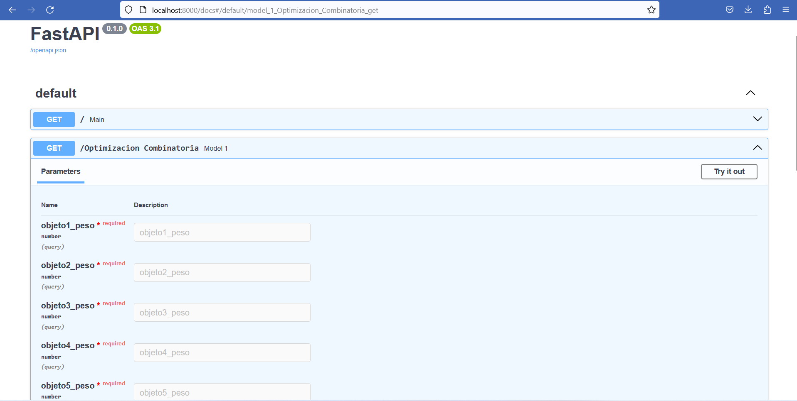

# Fast_API_Optimiza

En este respositorio se encuentra una API con un endpoint,el cual permite resolver un modelo de optimización combinatoria.Especificamente la API permite resolver una instancia del problema de la mochila,el cual se expone de forma general a continuación.

$$ max \sum_{j=1}^n v_{j} x_{j} $$
       
sujeto a 

$$ \sum_{j=1}^n w_{j}x_{j} \leq c \ \ \ \ i=1,2,...,m $$

$$ x_{i} \in \{0,1\} $$

Sin embargo en la API,se instancia el problema en donde solo se tiene un total de 5 objetos.En donde se puede definir el peso de cada objeto y el peso total que soporta la mochila.

## Estructura

El siguiente proyecto considera como archivos y elementos principales,el archivo **Main.py**,y la carpeta **modelo_optimizacion**.


``` docker
- 📁 Fast_API_Optimiza
  - 📄 .gitignore
  - 📄 Dockerfile
  - 📄 README.md
  - 📄 requirements.txt
  - 🖼️ api_opti.png
    - 📁 app
        - 📄 main.py                
        - 📁 modelo_optimizacion
            - 📄 modelo_optimizacion.py
            - 📄 modelo.pkl
        - 📁 glpk-4.65
```

## Modelo de optimizacion

Dentro de la carpeto **Modelo_optimizacion**,se encuentra la definición del modelo de optimización.Cabe considerar que la API, resuelve una instancia particular del problema de la mochila,en donde los unicos parametros configurables son los pesos de cada objeto y el peso que soporta la mochila.

$$ max \sum_{j=1}^5 0.2x_{j} $$

sujeto a 

$$ \sum_{j=1}^5 w_{j}x_{j} \leq c \ \ \ \ i=1,2,...,m $$

$$ x_{i} \in \{0,1\} $$

Como se ve en el modelo,la utilidad de cada objeto es fija y es la misma para cada objeto.

## Run API

La API tiene un endpoint,que en este caso corresponde a un método GET.Este método tiene 6 variables de entrada correspondientes a los pesos de los objetos y el peso total.

Finalmente desde la terminal tenemos que ejecutar la siguiente linea para lanzar el servicio de forma local.

``` docker
uvicorn api.main:app --reload

```

